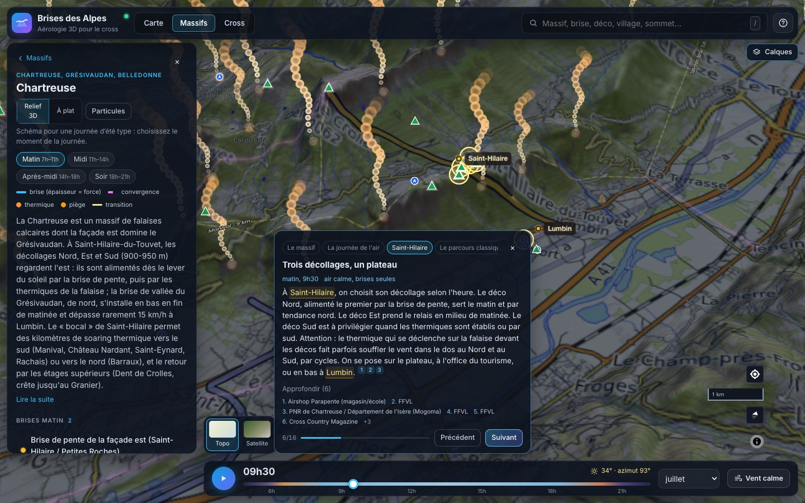
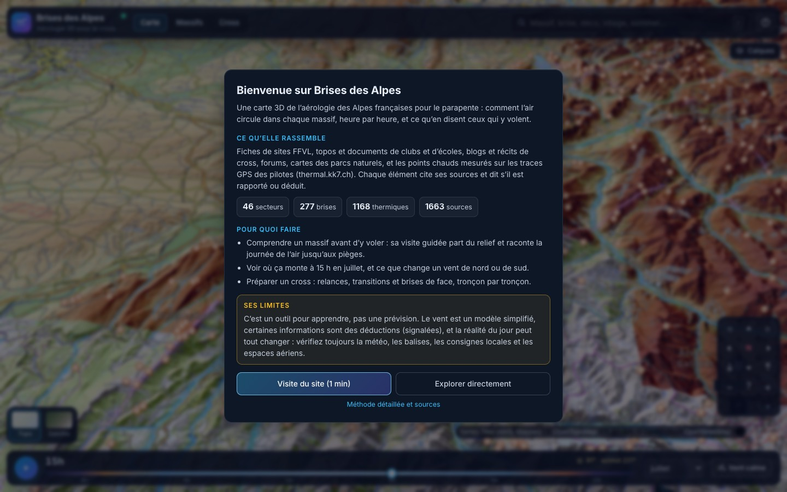
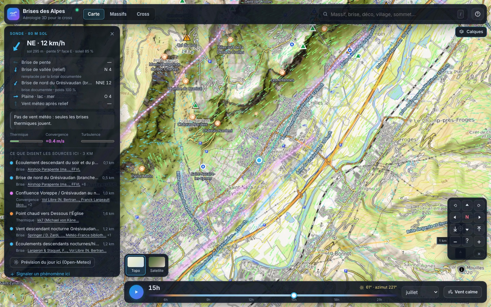
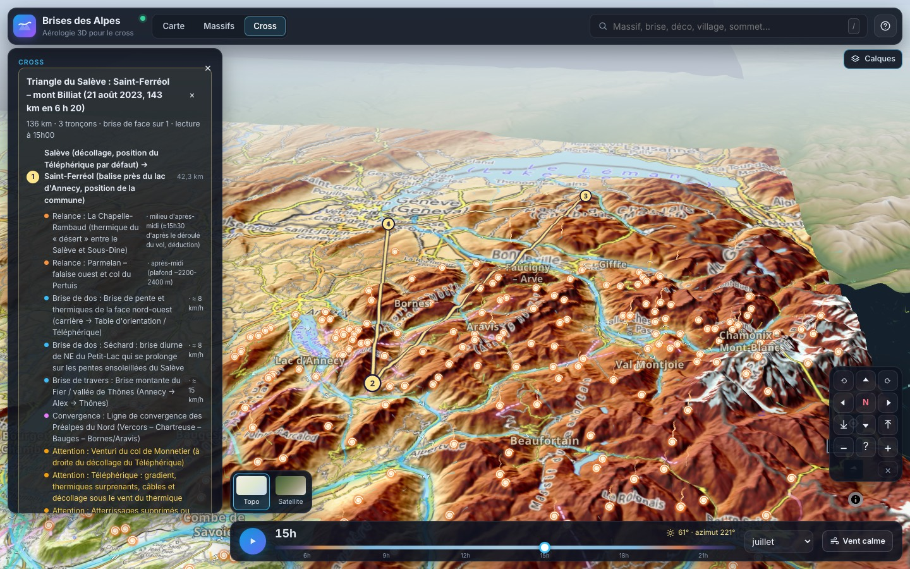
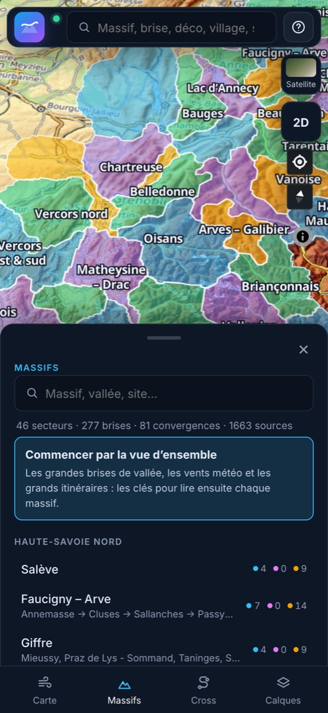
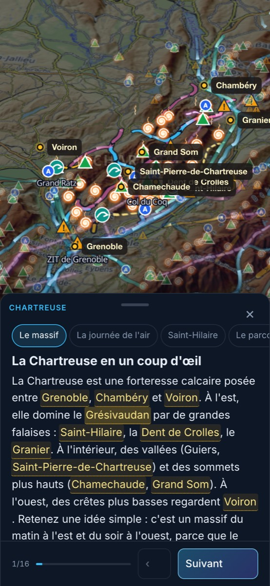
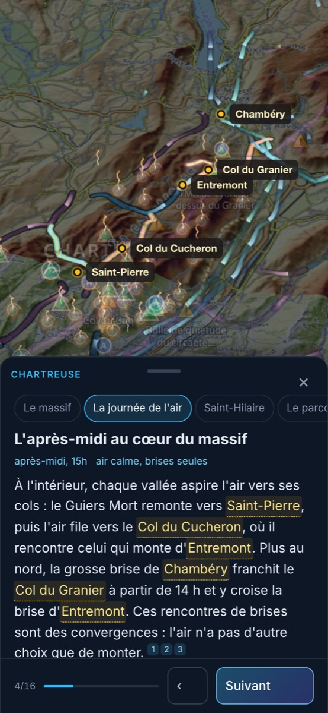

# Brises des Alpes

Carte 3D de l'aérologie des Alpes françaises pour le parapente et le cross : comment l'air circule
dans chaque massif, heure par heure, et ce qu'en disent ceux qui y volent. Brises de pente et de
vallée, convergences, thermiques, pièges, soaring, décollages et atterrissages sont simulés en direct
dans le navigateur selon l'heure, le mois et le vent météo, et chaque élément cite ses sources.



> Outil pour apprendre, pas une prévision. Le vent est un modèle conceptuel calé sur la
> littérature et les récits de pilotes ; certaines informations sont des déductions (signalées).
> Vérifiez toujours la météo, les balises, les consignes locales et les espaces aériens avant de voler.

## Ce que rassemble l'atlas

Fiches de sites FFVL, topos et documents de clubs et d'écoles, blogs et récits de cross, forums,
cartes des parcs naturels, et les points chauds mesurés sur les traces GPS des pilotes
([thermal.kk7.ch](https://thermal.kk7.ch)). Chaque élément dit s'il est rapporté, mesuré ou déduit.

| 46 secteurs | 277 brises | 81 convergences | 1 168 thermiques | 527 pièges |
| --- | --- | --- | --- | --- |
| **542 décollages** | **307 atterrissages** | **117 zones de soaring** | **184 itinéraires** | **1 663 sources** |

Les secteurs couvrent les Alpes françaises sans trou ni recouvrement, de la Haute-Savoie aux
Alpes-Maritimes. Les positions sont vérifiées sur l'altimétrie IGN ; 502 thermiques documentés
sont confirmés par un point chaud GPS de kk7, et 345 points chauds forts qu'aucun texte ne décrit
sont ajoutés comme thermiques « mesurés ».

## Le site en images

**Accueil.** À la première visite, une présentation du projet, de ses données et de ses limites,
puis une visite d'une minute qui montre chaque partie de l'interface.



**Sonde.** Touchez un point : vent au sol décomposé (pente, vallée, plaine, météo), thermique,
convergence, turbulence, puis ce que disent les sources à moins de 3 km, avec leurs liens.



**Cross.** Les grands itinéraires documentés lus tronçon par tronçon : relances, brises de face,
de dos ou de travers, convergences et pièges à l'heure choisie. On peut aussi tracer le sien.



**Sur téléphone.** La carte schématique des secteurs, puis la visite guidée de chaque massif,
du global au détail : les lieux cités sont surlignés dans le texte et épinglés sur la carte.

<p>
  
  
  
</p>

## Fonctionnalités

Deux modes, un bouton pour passer de l'un à l'autre : **Explorer** (massifs, visites guidées,
itinéraires, ce que disent les sources) et **Simuler** (vent météo, lecture du relief, prévision).

- **Relief 3D** par défaut (MNT 216 m, exagération réglable, 2D disponible) sur plan topographique
  ou orthophoto, avec l'ombrage solaire réel de l'heure choisie.
- **Simulation de vent dans le navigateur (WebGL2)** : brises de pente, de vallée, de lac, de plaine
  vers la montagne, vent météo canalisé, abrité ou accéléré, convergences calculées ; repli CPU
  (Web Worker). Changement d'heure, de mois ou de régime de vent instantané.
- **Animations** : particules de vent, comètes le long des brises documentées, colonnes thermiques ;
  convergences dessinées comme des zones où deux flux se rencontrent, actives à leurs heures ;
  lecture du relief au vent / sous le vent, thermique, convergences, ascendances, force.
- **Pages de massif** : schéma d'une journée type (matin, midi, après-midi, soir), brises,
  thermiques, pièges et sources, et une visite guidée narrative pour chacun des 46 secteurs.
- **Prévision** (Open-Meteo, AROME/ARPEGE) : en mode Simuler, le vent d'aujourd'hui, de demain ou
  d'après-demain pilote la carte heure par heure autour de la vue ; à la sonde, plafond, couche
  limite, isotherme 0 °C et émagramme simplifié.
- **Dangers documentés** : un piège que les sources lient à un vent (« turbulent par nord même
  faible ») s'affiche sous le vent ou turbulent quand le vent simulé correspond, et la sonde le
  nomme avec ses sources ; le contrôle du modèle les vérifie à l'endroit même.
- **Sites et espaces aériens** : sites FFVL officiels et communautaires (OpenStreetMap,
  ParaglidingEarth), espaces aériens indicatifs, recherche de décos, villages, brises et massifs.
- **Retours des pilotes** : « je confirme / pas observé », corrections, ajout d'un phénomène tracé
  sur la carte ; relus par un modérateur avant d'entrer dans l'atlas.
- **Téléphone** : feuille glissante à trois hauteurs, barre d'onglets, cadence d'animation adaptée.

## Démarrage rapide

Prérequis : Node.js 22+, npm 10+.

```bash
npm ci
npm run dev          # front seul (mode autonome : données statiques)
npm run dev:api      # dans un 2e terminal : API + base PGlite locale (aucune installation)
```

Ouvrir http://localhost:5173. Avec l'API lancée, le badge passe à « en ligne » (Vite redirige `/api`
vers le port 8080) : atlas servi par la base, prévisions mutualisées, contributions.

Contrôles : glisser pour tourner, clic droit / Ctrl+glisser pour incliner, `Espace` lecture de la
journée, `Maj+←/→` heure par heure, `/` recherche, `Échap` ferme les fiches.

## Commandes

| Commande | Rôle |
| --- | --- |
| `npm run dev` / `npm run dev:api` | développement front / API |
| `npm run build` | typage + build du front (`apps/web/dist`) et de l'API (`apps/api/dist`) |
| `npm run typecheck` · `npm run lint` · `npm test` | contrôles (modèle, données, API) |
| `npx tsx apps/web/e2e/journeys.ts [url]` | parcours bureau et téléphone en Chromium headless, avec captures |
| `npm run data:build [-- --check]` | compile la recherche JSON en atlas (+ `docs/DATA_QA.md`, `docs/KK7_CROISEMENT.md`) |
| `npm run model:check` | fidélité du modèle aux phénomènes documentés (`docs/MODEL_QA.md`) |
| `npm run data:coverage` | couverture des secteurs (`docs/COUVERTURE.md`) |
| `npm run data:dem` · `data:airspace` · `data:sites` | MNT, espaces aériens, sites FFVL |
| `npm run data:contributions` | contributions acceptées → jeu de données de l'atlas |

## Organisation

```
apps/web         Front React 19 + MapLibre GL + moteur de vent GPU (Vite)
apps/api         API Fastify + PostgreSQL/PostGIS (PGlite en dev et tests)
packages/model   Modèle de vent de référence (terrain, soleil, brises)
packages/shared  Types de l'atlas, contrats des fournisseurs, schéma des contributions
scripts          Pipeline de données : atlas, découpage des secteurs, croisement kk7, contrôles
research_notes   Recherche par massif : notes, données JSON, visites guidées, positions, rapports
deploy           Dockerfiles, Nginx (ports local et public, authentification), installation
docs             Architecture, méthodologie, données, qualité, déploiement
```

## Documentation

- [Architecture et points d'extension](docs/ARCHITECTURE.md) · [Méthodologie du modèle de vent](docs/METHODOLOGIE.md)
- [Données : contrat, ajout d'une collecte, contributions](docs/DONNEES.md) · [Positions vérifiées](docs/POSITIONS.md)
- Qualité : [données](docs/DATA_QA.md) · [modèle](docs/MODEL_QA.md) · [couverture](docs/COUVERTURE.md) · [croisement kk7](docs/KK7_CROISEMENT.md)
- [Déploiement](docs/DEPLOYMENT.md) (installation en une commande : `deploy/install.sh`) · [Passation](docs/PASSATION.md)
- [Benchmark des sources météo](docs/WEATHER_BENCHMARK.md) · [Synthèse de la recherche](reports/Brises%20des%20Alpes%20fran%C3%A7aises.md)

## Feuille de route

1. **Météo en direct** : vent synoptique et profils sur une grille préchargée, balises temps réel
   (FFVL, Pioupiou, Holfuy).
2. **Traces de vol** (IGC) : brises et zones descendantes estimées à partir des vitesses et des taux
   de montée, pour caler le modèle au-delà des points chauds kk7.
3. Extension aux Alpes suisses, italiennes et autrichiennes (même contrat de données).

L'architecture prévoit ces ajouts (fournisseurs abstraits, modules de carte, tables PostGIS) sans
les activer. Voir [ARCHITECTURE.md](docs/ARCHITECTURE.md#évolutions-prévues).

## Licences des données

Usage non commercial. Relief : Terrain Tiles (AWS, Mapzen ; SRTM, EU-DEM…), altimétrie IGN
(RGE ALTI). Imagerie : IGN Géoplateforme, OpenTopoMap, OpenFreeMap / OpenStreetMap. Prévisions :
Open-Meteo (CC BY 4.0). Sites : FFVL (data.gouv), OpenStreetMap (ODbL), ParaglidingEarth. Espaces
aériens : planeur-net (indicatif). Points chauds : thermal.kk7.ch (Michael von Känel, usage non
commercial). Contours départementaux : france-geojson (Licence Ouverte). Les textes de l'atlas
citent leurs sources.
