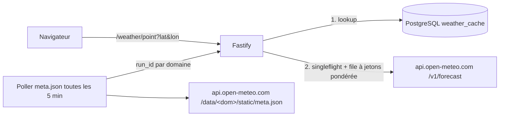

# Benchmark des sources météo et architecture recommandée

*Carte cross parapente des Alpes françaises. Rédigé le 2026-10-07.*

> **Méthode et fiabilité.** Depuis l'environnement de rédaction, le proxy réseau bloquait
> `api.open-meteo.com`, `data.gouv.fr`, `meteofrance.fr`, `dwd.de`, `ecmwf.int`, `geo.admin.ch`,
> `pioupiou.fr` et `winds.mobi`. GitHub restait accessible. Les affirmations sur Open-Meteo
> viennent donc directement du **code source** du serveur (`open-meteo/open-meteo`, commit
> `290493f`, 2026-10-06) et du **site** (`open-meteo/open-meteo-website`, commit `a76dad3`,
> 2026-10-05). C'est plus fiable qu'une page marketing, mais le service en production peut
> être configuré autrement (les limites sont des variables d'environnement). Les autres sources
> viennent de recherches web (WebSearch) et de dépôts GitHub. Chaque affirmation est suivie
> de sa source. Les points **non vérifiés** sont marqués ⚠️.
>
> Abréviations des liens de code :
> `OM` = `https://github.com/open-meteo/open-meteo/blob/290493f/Sources/App/`,
> `OMW` = `https://github.com/open-meteo/open-meteo-website/blob/a76dad3/src/routes/en/`.

---

## 0. Résumé exécutif

1. **Maintenant : Open-Meteo, appelé uniquement depuis notre backend Fastify.** Le backend
   met en cache par (modèle, cellule arrondie, run) et fusionne les requêtes concurrentes
   (*coalescing*). Il détecte les nouveaux runs grâce à
   `https://api.open-meteo.com/data/<domaine>/static/meta.json`. Ces fichiers ne sont pas
   décomptés du quota dans le code actuel.
   - Pour le profil vertical, le meilleur modèle est **AROME France 0,025°** :
     24 niveaux de pression, dont 900, 800, 750, 650 et 550 hPa.
   - ICON-D2 et IFS HRES 9 km complètent les indices (CIN, base convective, *updraft*, BLH).
2. **Le quota gratuit est par IP.** Notre serveur n'a qu'une IP, donc tous les utilisateurs
   partagent 10 000 « appels » par jour.
   - Une « fiche » complète en un point pèse environ 9 appels, car le poids d'un appel est
     `max(1, nb_variables × nb_modèles / 10)` et chaque niveau de pression compte comme une
     variable.
   - Avec le cache par run, on tient environ **300 utilisateurs actifs par jour**.
   - Le gratuit est aussi **réservé au non commercial**. Avec de la publicité ou un abonnement,
     il faut le plan Standard (≈ 29 €/mois ⚠️) ou l'auto-hébergement.
3. **Ensuite : auto-héberger Open-Meteo** (Docker AGPL-3.0, usage commercial autorisé,
   données CC BY 4.0). Le conteneur lit le miroir S3 public, qui contient AROME, ICON-D2,
   IFS, ARPEGE, MeteoSwiss, etc.
   - Cela supprime le problème de quota sans changer le code client : la syntaxe de l'API est
     identique.
   - Pour les **champs maillés** (vent synoptique sur toute la zone), lire directement les
     fichiers `data_spatial/` du S3 Open-Meteo ou les paquets GRIB2 AROME de data.gouv.fr,
     puis générer nos propres tuiles.
4. **Le code actuel présente trois problèmes.** Il appelle Open-Meteo depuis le navigateur
   (`packages/shared/src/open-meteo.ts`), sans cache partagé.
   - `pointForecast` n'indique pas `models`, donc il utilise `best_match`. Dans les Alpes
     françaises, `best_match` choisit la **pile ICON** (ICON-D2, ICON-EU, ICON, IFS, GFS), pas
     AROME : le domaine ICON-D2 est testé avant AROME
     ([OM Controllers/ForecastapiController.swift](https://github.com/open-meteo/open-meteo/blob/290493f/Sources/App/Controllers/ForecastapiController.swift)).
   - ICON-D2 n'a ni 750 ni 650 hPa. Ces niveaux du profil sont donc comblés silencieusement
     par un modèle plus grossier : la fusion prend le premier lecteur non-NaN par priorité
     ([OM Helper/Reader/GenericReaderMulti.swift](https://github.com/open-meteo/open-meteo/blob/290493f/Sources/App/Helper/Reader/GenericReaderMulti.swift)).

---

## 1. Open-Meteo

### 1.1 Limites du plan gratuit (exactes)

| Fenêtre | Limite | Source |
|---|---|---|
| Minute | **600 appels** | [Conditions OMW terms](https://open-meteo.com/en/terms), [OM Helper/Vapor/RateLimiter.swift](https://github.com/open-meteo/open-meteo/blob/290493f/Sources/App/Helper/Vapor/RateLimiter.swift) (`CALL_LIMIT_MINUTELY ?? 600`) |
| Heure | **5 000 appels** | idem (`CALL_LIMIT_HOURLY ?? 5_000`) |
| Jour | **10 000 appels** | idem (`CALL_LIMIT_DAILY ?? 10_000`) |
| Mois | **300 000 appels** (publié) | [Tarifs](https://open-meteo.com/en/pricing). ⚠️ Aucun compteur mensuel dans `RateLimiter.swift` : la limite paraît contractuelle, pas technique. |
| Localisations par requête | **1 000** (points ou cellules de *bounding box*) | [OM configure.swift](https://github.com/open-meteo/open-meteo/blob/290493f/Sources/App/configure.swift) (`LOCATIONS_LIMIT ?? 1000`) |
| Concurrence | 1 requête simultanée par IP (5 au maximum en limite dure) | `RateLimiter.swift` (`CONCURRENCY_LIMIT ?? 1`, `CONCURRENCY_LIMIT_HARD ?? 5`) |

Fonctionnement du limiteur, d'après le code de `RateLimiter.swift` et `ApiKeyManager.swift`
([OM Helper/Vapor/ApiKeyManager.swift](https://github.com/open-meteo/open-meteo/blob/290493f/Sources/App/Helper/Vapor/ApiKeyManager.swift)) :

- **Les limites s'appliquent par adresse IP**, pas globalement. Une IPv4 est comptée telle
  quelle et une IPv6 est hachée. Les IP des Cloudflare Workers sont comptées par en-tête
  `CF-Worker`.
- **Les fenêtres sont fixes, calées sur l'horloge UTC.** Le compteur minute est remis à zéro
  chaque minute. Le compteur horaire est remis à zéro quand `now % 3600 < 60` (début d'heure)
  et le compteur journalier à 00:00 UTC. Ce ne sont pas des fenêtres glissantes.
- **Contrôle avant, décompte après.** Le quota est vérifié avant la requête et le poids est
  ajouté après. Une seule grosse requête peut donc dépasser le seuil minute, puis bloquer
  les suivantes jusqu'à la minute suivante.
- **Une erreur coûte 1 appel.** Commentaire du code : « some users do infinite retries on
  errors ».
- **Une requête dont le poids dépasse 5 000 est refusée d'office.** Message : « Your API call
  requests too much data ».
- **Dépassement : HTTP 429**, avec `reason` = « Daily / Hourly / Minutely API request limit
  exceeded… ». En cas de surcharge du service : HTTP 503 « The service is overloaded ».

### 1.2 Comptage des « appels » (poids)

Le code ([OM Helper/Writer/ForecastApiResult.swift](https://github.com/open-meteo/open-meteo/blob/290493f/Sources/App/Helper/Writer/ForecastApiResult.swift), `calculateQueryWeight`) calcule :

```
poids(requête) = Σ_localisations max(1, max(V/10, (jours/14) × V/10))
avec V = (nb variables hourly + minutely_15 + current + daily) × nb de modèles demandés
```

Le nombre de modèles est le total des membres d'ensemble ([OM Controllers/ForecastapiController.swift](https://github.com/open-meteo/open-meteo/blob/290493f/Sources/App/Controllers/ForecastapiController.swift), `nVariables`).

Conséquences pratiques (la FAQ des [tarifs](https://open-meteo.com/en/pricing) confirme
« plus de 10 variables ou plus de 2 semaines = plusieurs appels, en fraction ») :

- **Chaque variable de niveau de pression compte comme une variable.** Par exemple,
  `temperature_850hPa` et `temperature_700hPa` font 2 variables. Un profil de 12 niveaux ×
  5 grandeurs coûte donc 60 variables, soit un poids de 6 par point.
- **Plusieurs localisations par requête ne réduisent pas le coût** : les poids s'additionnent.
  Cela ne fait gagner que des aller-retours HTTP. Une *bounding box* coûte le nombre de
  cellules du modèle dans la boîte.
- **Plusieurs modèles dans `models=` multiplient le coût.** Mieux vaut faire des requêtes
  séparées, chacune avec ses seules variables utiles.
- **Jusqu'à 14 jours, la durée ne coûte rien de plus.** Au-delà, le poids augmente
  proportionnellement.

### 1.3 Usage commercial et prix

- **Le plan gratuit est réservé au non commercial**, au sens de Creative Commons. Un site
  avec abonnement ou publicité est un usage commercial
  ([Conditions](https://open-meteo.com/en/terms),
  [source OMW terms/+page.svelte](https://github.com/open-meteo/open-meteo-website/blob/a76dad3/src/routes/en/terms/%2Bpage.svelte)).
  Les données sont sous **CC BY 4.0** : attribution obligatoire
  ([licence](https://open-meteo.com/en/licence)).
- **Plans payants** ([tarifs](https://open-meteo.com/en/pricing),
  [source OMW pricing/+page.svelte](https://github.com/open-meteo/open-meteo-website/blob/a76dad3/src/routes/en/pricing/%2Bpage.svelte)) :
  - Standard : 1 M appels/mois. Professional : 5 M. Enterprise : plus de 50 M.
  - Pas de limite minute, heure ou jour.
  - Endpoint dédié `customer-api.open-meteo.com` avec le paramètre `&apikey=`.
- **Prix** : ≈ **29 €/mois (Standard) et 99 €/mois (Professional)** selon des sources tierces
  ([apis.io](https://apis.io/plans/open-meteo/open-meteo-plans-pricing/),
  [ki-syndikat](https://www.ki-syndikat.de/tools/open-meteo/)). ⚠️ La page officielle affiche
  les prix dans un widget Stripe que je n'ai pas pu lire. Enterprise : sur devis.
- **Le plan Standard n'inclut pas les API historiques** (Historical Weather, Historical
  Forecast, Previous Runs, Single Runs, Ensemble). Le code renvoie
  `apiProfessionalRequired` sous 5 M d'appels/mois
  ([ApiKeyManager.swift](https://github.com/open-meteo/open-meteo/blob/290493f/Sources/App/Helper/Vapor/ApiKeyManager.swift)).
  Cela compte pour la corrélation avec les traces GPS.
- **Les limites mensuelles payantes ne sont pas encore appliquées techniquement.** Des alertes
  e-mail sont envoyées à 80, 90 et 100 % (FAQ tarifs).

### 1.4 Auto-hébergement

D'après [docs/getting-started.md](https://github.com/open-meteo/open-meteo/blob/290493f/docs/getting-started.md) et
[docs/downloading-datasets.md](https://github.com/open-meteo/open-meteo/blob/290493f/docs/downloading-datasets.md) :

- **Image Docker** `ghcr.io/open-meteo/open-meteo`. Elle expose la même API sur `:8080`.
  - Le **mode « distant »** (`REMOTE_DATA_DIRECTORY=https://openmeteo.s3.amazonaws.com/data/`)
    lit le miroir S3 à la demande avec un cache LRU local (`CACHE_SIZE`). Il vérifie les
    mises à jour environ toutes les 2 minutes.
  - Le **mode « sync »** réplique localement des domaines et variables choisis :
    `sync dwd_icon_d2,meteofrance_arome_france0025 <variables> --past-days 3 --repeat-interval 5`.
- **Matériel minimum** : CPU avec AVX2 (x86-64 ou ARM), 8 Go de RAM (16 Go recommandés),
  ≥ 100 Go de SSD NVMe. Une instance auto-hébergée est plus lente que l'API publique quand
  le cache est froid (quelques secondes), et S3 est en `us-west-2`.
- **Licences** : code sous AGPL-3.0 (sans modification, aucune obligation particulière),
  données sous CC BY 4.0. **L'usage commercial auto-hébergé est explicitement autorisé.**
- **Modèles présents sur le S3** (et donc auto-hébergeables sans téléchargement GRIB)
  ([open-meteo/open-data README](https://github.com/open-meteo/open-data/blob/4fd52ad/README.md)) :
  - `meteofrance_arome_france0025` : 6 variables × 24 niveaux de pression.
  - `meteofrance_arome_france_hd`, `meteofrance_arome_france(_hd)_15min`,
    `meteofrance_arpege_europe` (23 niveaux).
  - `dwd_icon_d2` (11 niveaux), `dwd_icon_d2_15min`, `dwd_icon_eu` (17 niveaux).
  - `ecmwf_ifs025` (9 niveaux), `ecmwf_aifs025_single`, `ecmwf_ifs` (9 km).
  - `meteoswiss_icon_ch1/ch2` (sans niveaux de pression), GFS.
  - **Non publiés** : climat, crues, satellite, ensembles.
- **Trois arborescences sur le S3** :
  - `data/` : séries temporelles « roulantes », avec `data/<modèle>/static/meta.json`.
  - `data_spatial/<modèle>/<run>/<timestamp>.om` : **tous les champs d'un pas de temps dans
    un fichier, conservé 7 jours**, avec `latest.json` et `in-progress.json`. C'est idéal pour
    fabriquer des tuiles.
  - `data_run/` : un run complet, 13 niveaux de pression.
- **Lecteur TypeScript/WASM** : `@openmeteo/file-reader` lit les fichiers `.om` en HTTP ou S3
  avec des lectures partielles. Le projet signale « pas encore prêt pour la production »
  ([typescript-omfiles](https://github.com/open-meteo/typescript-omfiles)).
- **Téléchargement direct des sources** : les commandes `download`, `download-meteofrance`,
  `download-ecmwf` et `download-meteoswiss` existent. Le téléchargeur Météo-France lit
  `object.data.gouv.fr/meteofrance-pnt/…` sans clé, ou le portail Météo-France avec
  `METEOFRANCE_API_KEY`
  ([OM MeteoFrance/MeteoFranceDownloader.swift](https://github.com/open-meteo/open-meteo/blob/290493f/Sources/App/MeteoFrance/MeteoFranceDownloader.swift)).

### 1.5 Modèles couvrant les Alpes françaises (bbox 4,85–7,85 E / 43,55–46,5 N)

Les variables suivent la colonne « Native fields » des pages de documentation
([OMW docs/meteofrance-api](https://github.com/open-meteo/open-meteo-website/blob/a76dad3/src/routes/en/docs/meteofrance-api/%2Bpage.svelte), `dwd-api`, `ecmwf-api`, `meteoswiss-api`, `gfs-api`).
Elles ont été recoupées avec les variables téléchargées dans le serveur
(`MeteoFranceDomain.swift`, `IconVariableDownloadable.swift`, `EcmwfVariable.swift`,
`MeteoSwissVariable.swift`, `Gfs*`).

| `models=` (API) | Domaine `meta.json` | Résolution | Horizon | Runs | Niveaux de pression (hPa) | BLH | CAPE | CIN | LI | Isotherme 0 °C | Base cumulus | 15 min |
|---|---|---|---|---|---|---|---|---|---|---|---|---|
| `meteofrance_arome_france` | `meteofrance_arome_france0025` | 0,025° (~2,5 km) | 51 h | 3 h | **24 niveaux : 1000, 950, 925, 900, 850, 800, 750, 700, 650, 600, 550, 500 … 100.** T, HR, Td dérivé, vent, Z, (w) | – | ✔ | – | – | – | – | `meteofrance_arome_france_15min` (6 h, quelques variables) |
| `meteofrance_arome_france_hd` | `meteofrance_arome_france_hd` | 0,01° (~1,5 km) | 51 h | 3 h | **aucun** (vent 10–200 m seulement) | – | – | – | – | – | – | `…_hd_15min` |
| `meteofrance_arpege_europe` | `meteofrance_arpege_europe` | 0,1° | 4 j | 6 h | 24 niveaux 1000…100 | – | ✔ | – | – | – | – | – |
| `meteofrance_seamless` | AROME puis ARPEGE | – | 4 j | – | selon le modèle sous-jacent | – | ✔ | – | – | – | – | – |
| `icon_d2` / `dwd_icon_d2` | `dwd_icon_d2` | 0,02° (~2 km) | 48 h | 3 h | **11 niveaux seulement : 1000, 975, 950, 850, 700, 600, 500, 400, 300, 250, 200** | – | ✔ | ✔ | – | ✔ | ✔ `convective_cloud_base/top` (convection peu profonde) + `updraft` (w max) + `lightning_potential` | `dwd_icon_d2_15min` (CAPE, isotherme 0 °C, précipitations, rayonnement) |
| `icon_eu` / `dwd_icon_eu` | `dwd_icon_eu` | 0,0625° (~7 km) | 5 j | 3 h | 1000, 950, 925, 900, 850, 800, 700, 600, 500, … (17) | – | ✔ | ✔ | – | ✔ | ✔ | – |
| `ecmwf_ifs` (HRES) | `ecmwf_ifs` | 9 km (O1280) | 15 j | 6 h | **aucun** | **✔** | ✔ | ✔ | – | – | – | – |
| `ecmwf_ifs025` | `ecmwf_ifs025` | 0,25° | 15 j (pas de 3 h) | 6 h | 1000, 925, 850, 700, 600, 500, 400, 300, 250, 200, 150, 100, 50 | – | ✔ | – | – | – | – | – |
| `ecmwf_aifs025_single` | `ecmwf_aifs025_single` | 0,25° | 15 j (pas de 6 h) | 6 h | 12 niveaux | – | – | – | – | – | – | – |
| `gfs_seamless` | `ncep_gfs013` / `ncep_gfs025` | 0,11° / 0,25° | 16 j | 6 h | 44 niveaux dont 975…650 tous les 25 hPa | **✔** | ✔ | ✔ | **✔** | ✔ | – | – |
| `meteoswiss_icon_ch1` | `meteoswiss_icon_ch1` | ~1 km | 33 h | 3 h | **aucun** (« pas encore intégré ») | – | ✔ | ✔ | – | ✔ | ✔ `cloud_base` | – |
| `meteoswiss_icon_ch2` | `meteoswiss_icon_ch2` | ~2 km | 120 h | 6 h | aucun | – | ✔ | ✔ | – | ✔ | ✔ | – |

Remarques :

- **`sunshine_duration` est disponible pour tous les modèles.** Pour AROME, Open-Meteo le
  dérive (secondes par heure où le DNI dérivé dépasse 120 W/m²). Il est natif pour IFS HRES
  et ICON-CH. `shortwave_radiation` existe partout.
- **Les variables absentes d'un modèle renvoient `null`.** L'isotherme 0 °C n'est **pas**
  calculée depuis le profil pour AROME : seuls ICON, ICON-CH et GFS la fournissent nativement
  ([OM Controllers/VariableHourly.swift](https://github.com/open-meteo/open-meteo/blob/290493f/Sources/App/Controllers/VariableHourly.swift)).
  Pour AROME, la calculer nous-mêmes depuis le profil (§6).
- **Aire de chaque domaine** :
  - AROME 0,025° : 37,5–55,4 N, −12–16 E
    ([OM MeteoFrance/MeteoFranceDomain.swift](https://github.com/open-meteo/open-meteo/blob/290493f/Sources/App/MeteoFrance/MeteoFranceDomain.swift)).
  - ICON-D2 : 43,18–58,08 N, −3,94–20,3 E
    ([OM Icon/Icon.swift](https://github.com/open-meteo/open-meteo/blob/290493f/Sources/App/Icon/Icon.swift)).
  - Les deux couvrent toute la bbox.
- **Délai de disponibilité** : le téléchargeur Open-Meteo compte environ 3 h 40 après
  l'heure d'initialisation pour AROME et ARPEGE (commentaires de `MeteoFranceDomain.swift`).
  ECMWF open data publie 7 à 9 h après le run
  ([ecmwf-opendata README](https://github.com/ecmwf/ecmwf-opendata/blob/d2f7c9f/README.md)).
  Open-Meteo distribue IFS 9 km « sans délai additionnel »
  ([OMW docs/ecmwf-api](https://github.com/open-meteo/open-meteo-website/blob/a76dad3/src/routes/en/docs/ecmwf-api/%2Bpage.svelte)).

### 1.6 Détection d'un nouveau run (`meta.json`)

- **URL vérifiée dans le code.** Le serveur écrit le fichier sous
  `data/<domaine>/static/meta.json`
  ([OM Helper/File/ModelMetaJson.swift](https://github.com/open-meteo/open-meteo/blob/290493f/Sources/App/Helper/File/ModelMetaJson.swift)).
  La page « Model updates » le lit sur
  `https://api.open-meteo.com/data/${model}/static/meta.json?cache_buster=<ms>`
  ([OMW docs/model-updates/+page.svelte](https://github.com/open-meteo/open-meteo-website/blob/a76dad3/src/routes/en/docs/model-updates/%2Bpage.svelte)).
  - Variante commerciale : `https://customer-api.open-meteo.com/...`.
  - Variante auto-hébergée : `<serveur>/data/...`.
  - Miroir S3 : `https://openmeteo.s3.amazonaws.com/data/<domaine>/static/meta.json`.
- **Champs (struct `ModelUpdateMetaJson`, timestamps Unix en secondes)** :
  - `last_run_initialisation_time` : heure du run, par exemple 06Z.
  - `last_run_modification_time` : fin de conversion sur le serveur de traitement.
  - `last_run_availability_time` : disponibilité sur le serveur API interrogé.
  - `temporal_resolution_seconds`, `data_end_time`, `update_interval_seconds` (10800 pour
    AROME), `chunk_time_length`, `crs_wkt`.
- **Le nom du domaine diffère parfois du nom de modèle de l'API.** Par exemple
  `meteofrance_arome_france0025` correspond à `models=meteofrance_arome_france`, et
  `ncep_gfs025` à `gfs_seamless` pour les niveaux de pression. Voir le tableau du §1.5.
- **Retard d'un run** : le site considère un run « en retard » si
  `last_run_availability_time + update_interval_seconds + 20 min < now`.
- **Coût en quota** : dans le code actuel, les fichiers `.json` sous `/data/` sont servis
  **sans passer par le limiteur**
  ([OM Controllers/S3DataController.swift](https://github.com/open-meteo/open-meteo/blob/290493f/Sources/App/Controllers/S3DataController.swift)
  ne passe par `withFreeApiRateLimiter` que pour l'hôte `data-spatial`). Les interroger toutes
  les 5 minutes ne consomme donc pas de quota. ⚠️ Comportement constaté dans le code, pas
  garanti contractuellement : rester raisonnable (1 requête / 5 min / domaine).
- ⚠️ Réponse en direct non vérifiée : `api.open-meteo.com` était bloqué depuis le bac à sable.
- **Pour les données maillées sur S3**, `data_spatial/<modèle>/latest.json` indique le
  dernier run complet
  ([open-data README](https://github.com/open-meteo/open-data/blob/4fd52ad/README.md)).

### 1.7 Previous runs, Historical Forecast, Historical Weather, Single runs

| API (hôte) | Contenu | Profondeur | Usage pour nous |
|---|---|---|---|
| Previous Runs (`previous-runs-api.open-meteo.com`) | `variable_previous_dayN` : valeur prévue N×24 h avant (N = 1…7) | archivée depuis janvier 2024 (GFS T2m depuis mars 2021) ([OMW docs/previous-runs-api](https://github.com/open-meteo/open-meteo-website/blob/a76dad3/src/routes/en/docs/previous-runs-api/%2Bpage.svelte)) | Évaluer la fiabilité des prévisions par site |
| Historical Forecast (`historical-forecast-api.open-meteo.com`) | Concaténation des premières heures de chaque run, **niveaux de pression inclus** | AROME HD et ARPEGE Europe depuis 2022-11-13 ; AROME 0,025° depuis 2024-01-02 ; ICON-D2 et ICON-EU depuis 2022-11-24 ; IFS 0,25° depuis 2024-02-03 ([OMW docs/historical-forecast-api](https://github.com/open-meteo/open-meteo-website/blob/a76dad3/src/routes/en/docs/historical-forecast-api/%2Bpage.svelte)) | **Corréler les traces GPS** avec des profils haute résolution |
| Historical Weather (`archive-api.open-meteo.com`) | Réanalyses : IFS 9 km (depuis 2017), ERA5 0,25° (depuis 1940), ERA5-Land 0,1°, CERRA 5 km (1985–06/2021). **Pas de niveaux de pression.** BLH disponible via ERA5. ([OMW docs/historical-weather-api](https://github.com/open-meteo/open-meteo-website/blob/a76dad3/src/routes/en/docs/historical-weather-api/%2Bpage.svelte)) | ERA5 : J−5 | Climatologie, BLH historique |
| Single Runs (`single-runs-api…`, `&run=`) | Un run complet par heure d'initialisation | Depuis le 2 avril 2026 (IFS 9 km depuis mars 2024) ([OMW docs/single-runs-api](https://github.com/open-meteo/open-meteo-website/blob/a76dad3/src/routes/en/docs/single-runs-api/%2Bpage.svelte)) | Rejouer exactement le run du jour d'un vol |

- **Limites** : ce sont les mêmes compteurs gratuits (même `RateLimiter`).
- **Coût des plages longues** : au-delà de 14 jours, le coût augmente proportionnellement.
  Une année de 10 variables pèse environ 26 appels par point.
- **Usage commercial** : ces API demandent le plan **Professional** ou plus (§1.3).
- **Données historiques immuables** : leur durée de cache est illimitée.

---

## 2. Météo-France open data

- **Licence : Licence Ouverte Etalab 2.0**, réutilisation commerciale permise avec mention
  de la source. Toutes les données publiques sont gratuites depuis le 1ᵉʳ janvier 2024
  ([communiqué](https://www.transformation.gouv.fr/files/presse/COMMUNIQUE%20DE%20PRESSE%20%20-%20A%20PARTIR%20DU%201ER%20JANVIER%202024%20TOUTES%20LES%20DONN%C3%89ES%20PUBLIQUES%20DE%20METEO-FRANCE%20SERONT%20ACCESSIBLES%20SANS%20FRAIS%20ET%20GRATUITEMENT%20R%C3%89UTILISABLES.pdf),
  [data.gouv AROME](https://data.gouv.fr/en/datasets/donnees-du-modele-atmospherique-arome-a-aire-limitee-a-haute-resolution)).
- **Deux canaux d'accès** :
  1. **meteo.data.gouv.fr / data.gouv.fr : paquets GRIB2 en téléchargement de masse, sans
     clé ni inscription.**
     - Sources :
       [lancement meteo.data.gouv.fr](https://www.data.gouv.fr/posts/lancement-de-meteo-data-gouv-fr),
       [Paquets AROME 0,025°](https://www.data.gouv.fr/datasets/paquets-arome-resolution-0-025deg),
       [Paquets AROME 0,01°](https://www.data.gouv.fr/fr/datasets/paquets-arome-resolution-0-01deg),
       [guide données météo](https://guides.data.gouv.fr/guides/reutiliser-des-donnees/prise-en-main-des-donnees-meteorologiques).
     - Motif d'URL (vérifié dans le code d'Open-Meteo et le service d'extraction de
       data.gouv) :
       `https://object.data.gouv.fr/meteofrance-pnt/pnt/<RUN ISO>:00Z/arome/0025/<PAQUET>/arome__0025__<PAQUET>__<ÉCHÉANCES>__<RUN>:00Z.grib2`.
     - Le service d'extraction purge les lots de plus d'environ 1 jour : **rétention courte**,
       il faut moissonner en continu
       ([datagouv/mf-data-extract-service](https://github.com/datagouv/mf-data-extract-service/blob/032d5ab/README.md)).
  2. **portail-api.meteofrance.fr : clé API gratuite** (jeton issu du portail).
     - API « AROME » en WCS : *subset* bbox, niveau et temps, donc de petits fichiers.
     - API « Paquets AROME/ARPEGE » et « AROME PI ».
     - **Quota par minute.** Il était de 50 req/min. **Depuis janvier 2026, il est passé
       expérimentalement à 100 req/min** pour AROME, Paquets AROME, AROME PI, ARPEGE, etc.
       Au-delà : HTTP 429
       ([Confluence Météo-France – doublement des quotas](https://confluence-meteofrance.atlassian.net/wiki/spaces/OpenDataMeteoFrance/pages/1426423810),
       [Qualité de service](https://confluence-meteofrance.atlassian.net/wiki/spaces/OpenDataMeteoFrance/pages/875069450/Qualit+de+service+des+APIs+disponibles+sur+le+portail+de+M+t+o-France)).
     - L'API Paquets ne permet pas les requêtes par plage d'octets (*range requests*) : il
       faut télécharger le fichier entier (commentaire dans `MeteoFranceDownloader.swift`).
- **AROME 0,025°** (grille EURW1S40)
  ([description technique des paquets AROME](https://donneespubliques.meteofrance.fr/client/document/descriptiontechnique_paquetsarome_donneespubliques_v2_20240402_367.pdf),
  résumé via recherche web ⚠️ PDF non lu directement) :
  - 0 à 51 h au pas horaire, 9 groupes d'échéances (00–06, 07–12, …, 49–51). Runs toutes les
    3 h.
  - **IP1** (isobares) : T, HU, U, V, Z sur **24 niveaux de 100 à 1000 hPa**, environ
    **444 Mo par groupe**. Les paquets IP2 à IP5 contiennent d'autres champs isobares
    (Td, w, etc. — voir les commentaires de `MeteoFranceDomain.swift`).
  - **HP1** (hauteurs au-dessus du sol) : T, HU, U, V, DD, FF, P, Z sur **24 niveaux de 20 à
    3000 m**, environ **700 Mo par groupe**. Très intéressant pour les brises et le vent
    près du relief.
  - **SP1, SP2, SP3** (surface) : pression mer, vent et rafales 10 m, T et HR 2 m,
    nébulosités totale, basse, moyenne et haute, précipitations, rayonnement, flux de
    chaleur (SP3).
  - **Volume** : un run AROME 0,025° complet en IP1 + HP1 fait environ (444 + 700) × 9 ≈
    **10 Go**, soit environ **80 Go/jour** pour 8 runs (estimation ⚠️).
- **AROME 0,01°** (2801 × 1791 points, 0–51 h) : surface et quelques hauteurs (paquets SP1,
  SP2, SP3, HP1), sans niveaux de pression
  ([data.gouv 0,01°](https://data.gouv.fr/es/datasets/paquets-arome-resolution-0-01deg),
  [mf-data-extract-service config](https://github.com/datagouv/mf-data-extract-service/blob/032d5ab/config.py)).
- **AROME-PI (prévision immédiate)** : 0,01°, run horaire, échéances 0–6 h au pas de
  15 minutes ([meteociel](https://www.meteociel.fr/modeles/aromepi.php), data.gouv).
  Utile pour le « maintenant » (rafales, précipitations), pas pour les profils.
- **ARPEGE** : Europe 0,1° (0–102 h) et monde 0,25°, runs toutes les 6 h, 24 niveaux de
  pression (`MeteoFranceDomain.swift`).
- **Traitement nécessaire** : décodage GRIB2 avec compression CCSDS (`eccodes` ≥ 2.x,
  `cfgrib` ou `wgrib2`), découpe sur la bbox, désaccumulation des cumuls, U/V → force et
  direction, HU → Td, interpolation verticale.

## 3. DWD open data (ICON-D2, ICON-EU)

- **Accès** : `https://opendata.dwd.de/weather/nwp/{icon-d2,icon-eu}/grib/<HH>/<variable>/…grib2.bz2`.
  Il y a un fichier par variable, par niveau et par échéance, sans clé
  ([OM Icon/DownloadIconCommand.swift](https://github.com/open-meteo/open-meteo/blob/290493f/Sources/App/Icon/DownloadIconCommand.swift)).
- **ICON-D2 : environ 2,2 km, runs toutes les 3 h (00, 03, …, 21 UTC), horizon 48 h.**
  - L'horizon est indiqué par Open-Meteo et dans
    [docs/downloading-datasets](https://github.com/open-meteo/open-meteo/blob/290493f/docs/downloading-datasets.md).
    ⚠️ Le run de 03 UTC va jusqu'à +45 h selon le DWD (non vérifié ici).
  - Niveaux de pression : 200, 250, 300, 400, 500, 600, 700, 850, 950, 975, 1000 hPa
    (`Icon.swift`). Des niveaux modèle (65) et des niveaux de hauteur existent aussi sur le
    serveur du DWD ⚠️ non détaillé.
  - Champs propres à ICON-D2 : `hbas_sc` / `htop_sc` (base et sommet de la convection peu
    profonde), `w_ctmax` (*updraft* convectif max), `lpi`, `cin_ml`, `hzerocl`.
- **ICON-EU : 0,0625°, runs toutes les 3 h, horizon 120 h**, 17 niveaux (`Icon.swift`).
- **Licence** : open data du DWD, **CC BY 4.0**, usage commercial permis
  ([ki-syndikat (résumé)](https://www.ki-syndikat.de/tools/dwd-opendata/)). ⚠️ Page de
  conditions du DWD non consultée directement (domaine bloqué). Mention : « Datenbasis:
  Deutscher Wetterdienst ».
- **Effort** : plusieurs centaines de petits fichiers bz2 par run. La grille icosaédrique
  existe aussi en `regular-lat-lon` pour ICON-EU et ICON-D2. Le chemin le plus simple reste
  le miroir Open-Meteo.

## 4. ECMWF open data (IFS, AIFS)

- **Statut** : depuis le **1ᵉʳ octobre 2025**, tout le catalogue temps réel est sous
  **CC BY 4.0**
  ([ECMWF open data](https://www.ecmwf.int/en/forecasts/datasets/open-data),
  [forum ECMWF](https://forum.ecmwf.int/t/open-data-transition-on-01-october-2025/14121)).
  - Le sous-ensemble gratuit en téléchargement libre reste à **0,25°** (`resol` = `0p25` est
    la seule valeur).
  - La 9 km gratuite est annoncée « plus tard en 2026 », avec 2 h de latence
    ([ecmwf.int node/29497](https://www.ecmwf.int/node/29497) via recherche).
  - Open-Meteo redistribue déjà IFS HRES 9 km.
- **IFS 0,25°** : runs 00, 06, 12, 18 ; pas de 3 h jusqu'à 144 h puis 6 h jusqu'à 360 h
  (00 et 12 UTC).
  - Niveaux : 1000, 925, 850, 700, 600, 500, 400, 300, 250, 200, 150, 100, 50 (+10) hPa.
  - Variables : gh, t, u, v, r, q, w
    ([Herbie – ECMWF](https://herbie.readthedocs.io/en/latest/gallery/ecmwf_models/ecmwf.html),
    [OMW ecmwf-api/options.ts](https://github.com/open-meteo/open-meteo-website/blob/a76dad3/src/routes/en/docs/ecmwf-api/options.ts)).
- **AIFS single 0,25°** : pas de 6 h.
- **Limites** : 500 connexions simultanées sur `data.ecmwf.int`, avec des miroirs AWS, Azure
  et GCP. Les données sont disponibles 7 à 9 h après le run
  ([ecmwf-opendata README](https://github.com/ecmwf/ecmwf-opendata/blob/d2f7c9f/README.md)).
- **Verdict** : trop grossier pour les profils alpins (pas de 800 ni 750 hPa, pas de 3 h).
  Très bien pour le vent synoptique sur 5 à 10 jours. **IFS 9 km via Open-Meteo** apporte la
  BLH et la CIN.

## 5. MeteoSwiss open data (ICON-CH1/CH2)

- **Statut** : open data depuis mai 2025, via l'API STAC
  (`https://data.geo.admin.ch/api/stac/v1`, collections
  `ch.meteoschweiz.ogd-forecasting-icon-ch1` et `…-icon-ch2`)
  ([MeteoSwiss/opendata-forecast-data](https://github.com/MeteoSwiss/opendata-forecast-data/blob/66347e3/README.md),
  [opendatadocs](https://opendatadocs.meteoswiss.ch)).
- **Modèles** :
  - **ICON-CH1-EPS** : 1 km, 11 membres, 33 h, run toutes les 3 h.
  - **ICON-CH2-EPS** : 2,1 km, 21 membres, 120 h, run toutes les 6 h.
  - Grille icosaédrique native, 80 niveaux modèle suivant le terrain. Fichiers GRIB2
    multi-niveaux de 20 à 177 Mo (déterministe CH1).
  - **Seules les 24 dernières heures sont disponibles.**
- **Licence** : usage libre avec la mention « Source: MeteoSwiss »
  ([opendata.swiss](https://ckan.opendata.swiss/dataset/numerisches-wettervorhersagemodell-icon-ch1-eps)).
- **Pertinence** : le domaine couvre les Alpes françaises du Nord (Mont-Blanc, Chablais,
  Aravis…) ⚠️ l'étendue exacte du domaine n'a pas été vérifiée pour le Sud.
  - Via Open-Meteo, **pas de niveaux de pression** (« not yet integrated »), mais
    `cloud_base`, CAPE, CIN, isotherme 0 °C et ensoleillement natifs
    ([OMW docs/meteoswiss-api](https://github.com/open-meteo/open-meteo-website/blob/a76dad3/src/routes/en/docs/meteoswiss-api/%2Bpage.svelte)).
  - Intéressant en second avis à 1 km. L'ingestion GRIB directe sur grille icosaédrique est
    coûteuse.

## 6. Services spécialisés parapente (référence)

| Service | Ce qu'il propose | API ouverte ou abordable ? |
|---|---|---|
| **meteo-parapente.com** | Modèle propre WRF-ARW modifié, inspiré de RASP : environ 2,5 km au centre, 7,5 km en périphérie, forcé par GFS ([data sources](https://portal2.meteo-parapente.com/data-sources)) | ⚠️ Aucune API publique documentée trouvée. Contacter l'éditeur. |
| **RASP/BLIPMAP** (DrJack) | WRF + post-traitement « soaring » (w*, sommet de couche limite, Hcrit, cumulus) ([soaringmeteo RASP pdf](https://soaringmeteo.org/rasp.pdf), [paramètres](https://rkriz.net/Projects/RASP/PARAMETER_DEFINITIONS.html)) | Logiciel libre à faire tourner soi-même. Les instances françaises n'ont pas duré. **Source de formules** (§7). |
| **soaringmeteo.org** | Pipeline GFS + WRF (2 km Alpes), XC potential, w*, couche « soaring » ([GitHub, GPL-3.0](https://github.com/soaringmeteo/soaringmeteo)) | Code ouvert (GPL-3.0). Pas d'API de données documentée. **Bonne référence d'implémentation** ([Thermals.scala](https://github.com/soaringmeteo/soaringmeteo/blob/ed39857/backend/common/src/main/scala/org/soaringmeteo/Thermals.scala)). |
| **Meteoblue API** | API multi-modèles payante, par crédits : abonnement annuel plus crédits prépayés ; environ 8 000 crédits par appel « 7 jours, 14 variables » ([pricing](https://business.meteoblue.com/pricing), [API+](https://www.meteoblue.com/sk/blog/article/show/39887_API%2B+for+data+access+pay-as-you-go)) | Payant et cher à fort volume. ⚠️ Pas de paquet « soaring » identifié. |
| **Windy Point Forecast API** | Professional **990 €/an, 10 000 req/jour**. Modèles AROME, ICON-EU, GFS (ICON-D2 en Professional). Niveaux surface, 1000, 950, 925, 900, 850, 800, 700, 600, 500 … 150 hPa pour vent, T, Td, HR, gh ([pricing](https://api.windy.com/point-forecast/pricing), [docs](https://api.windy.com/point-forecast/docs)) | Abordable. Pas de 750 ni 650 hPa, ECMWF non inclus. Redondant avec Open-Meteo. |
| **XCSkies** | Couches « soaring », Skew-T interactif, prévisions point/route ; environ 4,95 $/mois pour les pilotes ([xcskies about](https://www.xcskies.com/about)) | Pas d'API publique identifiée. |

---

## 7. Observations temps réel (pour plus tard)

| Source | Accès | Fréquence | Conditions | TTL de cache conseillé |
|---|---|---|---|---|
| **Balises FFVL** ([data.gouv](https://www.data.gouv.fr/datasets/reseau-de-balises-et-donnees-meteo-de-la-ffvl)) | `https://data.ffvl.fr/api/?base=balises&r=list&mode=json&key=…` et `…&r=releves_meteo&key=…` ([winds-mobi provider ffvl.py](https://github.com/winds-mobi/winds-mobi-providers/blob/4b46e94/providers/ffvl.py)) | Environ 200 balises, mesures **toutes les 5 min**, 72 h d'historique | **Clé requise** (demande à la FFVL). ⚠️ Licence exacte non lue (la FFVL a publié d'autres jeux en ODbL ([OSM-talk-fr](https://lists.openstreetmap.org/pipermail/talk-fr/2012-December/052286.html))) | Liste des balises : 24 h. Relevés : **5 min** |
| **winds.mobi** | Agrégateur open source (AGPL-3.0) de FFVL, Holfuy, Pioupiou, MeteoSwiss, etc. Interroge chaque fournisseur **toutes les 5 min** ([run_scheduler.py](https://github.com/winds-mobi/winds-mobi-providers/blob/4b46e94/run_scheduler.py)) | 5 min | ⚠️ Conditions de l'API publique de winds.mobi non vérifiées (site bloqué). Plutôt réutiliser leurs *providers* (code AGPL). | 5 min |
| **Pioupiou / OpenWindMap** | `https://api.pioupiou.fr/v1/live-with-meta/all` (toutes les stations) ou `/v1/live/{id}` ([pioupiou.py](https://github.com/winds-mobi/winds-mobi-providers/blob/4b46e94/providers/pioupiou.py), [forum OpenWindMap](https://forum.openwindmap.org/post/3576)) | Environ 4 min (capteur) ; usage recommandé ≤ 1 req / 5 min | Sans clé. ⚠️ Licence non vérifiée (historiquement CC BY). | **5 min**, un seul appel `all` |
| **Holfuy** | `https://api.holfuy.com/live/?s=all&m=JSON…` et `/archive/` ([holfuy.py](https://github.com/winds-mobi/winds-mobi-providers/blob/4b46e94/providers/holfuy.py), [api.holfuy.com](https://api.holfuy.com)) | 1 à 5 min | **Mot de passe API sur demande** (info@holfuy.hu, décrire le projet). Le propriétaire de la station peut couper l'accès. | 5 min |

Recommandation :

- Faire **un seul moissonneur backend toutes les 5 min par fournisseur**, puis stocker les
  mesures dans PostGIS (table `observations(station_id, ts, geom, wind_avg, wind_max,
  dir, temp)`).
- Ne jamais faire interroger les fournisseurs par les navigateurs.
- Conserver l'historique pour la corrélation avec les traces de vol.

---

## 8. Tableau comparatif

| Source | Couverture / résolution | Cadence | Variables utiles par altitude | Limites / quotas | Licence & usage commercial | Effort d'intégration | Verdict |
|---|---|---|---|---|---|---|---|
| **Open-Meteo API gratuite** | Tous les modèles du §1.5 (AROME 2,5 km, ICON-D2 2 km, IFS 9 km…) | Selon le modèle (AROME et ICON-D2 : 3 h), détectable via `meta.json` | Profil complet AROME (24 niveaux T/Td/HR/vent/Z) + CAPE ; CIN, base convective, *updraft*, isotherme 0 °C (ICON-D2) ; BLH (IFS, GFS) ; LI (GFS) ; nuages, rayonnement, ensoleillement, précipitations | **600/min, 5 000/h, 10 000/jour par IP**, 300 000/mois ; ≤ 1 000 localisations par requête ; poids = variables/10 | CC BY 4.0, **non commercial seulement** | Très faible (JSON) | **Maintenant**, via le backend avec cache par run |
| **Open-Meteo API commerciale** | idem | idem | idem + API historiques (Professional) | 1 M (Standard) / 5 M (Pro) appels/mois, sans limite minute/heure/jour | CC BY 4.0, commercial OK ; ≈ 29 € / 99 € par mois ⚠️ | Nul (changement d'hôte + `apikey`) | Si le site devient commercial avant l'auto-hébergement |
| **Open-Meteo auto-hébergé** | Modèles du miroir S3 (AROME, ICON-D2, IFS, ARPEGE, MeteoSwiss, GFS…) | Le S3 est vérifié environ toutes les 2 min | idem API | Aucun quota (dépend de notre machine) | AGPL-3.0 (code) + CC BY 4.0 (données), **commercial OK** | Faible à moyen (Docker, disque NVMe, supervision) | **Étape suivante recommandée** |
| **Météo-France paquets (data.gouv)** | AROME 0,025° et 0,01°, ARPEGE 0,1° et 0,25° | AROME 3 h (0–51 h), ARPEGE 6 h | IP1 : T, HU, U, V, Z sur 24 niveaux ; **HP1 : 20–3000 m au-dessus du sol** ; SP* : surface, nuages, flux | Pas de clé ni de quota publié. **Rétention d'environ 1 jour.** Gros volumes (≈ 10 Go par run IP1 + HP1) | Licence Ouverte 2.0, commercial OK | Élevé (GRIB2/CCSDS, découpe, tuiles) | Pour un pipeline de tuiles maison (vent sur hauteurs sol) |
| **Météo-France portail API** | AROME (WCS avec subset), AROME-PI 0,01° en 15 min | AROME 3 h ; AROME-PI horaire | idem + nowcast 0–6 h | Clé gratuite, **100 req/min** (expérimental depuis janvier 2026, 50 avant) | Licence Ouverte 2.0 | Moyen à élevé | AROME-PI pour le « maintenant » ; WCS pour extraire la bbox |
| **DWD ICON-D2 / ICON-EU** | D2 2,2 km (Europe centrale, Alpes incluses) ; EU 7 km | 3 h | D2 : 11 niveaux de pression, **hbas_sc / htop_sc, w_ctmax, LPI, CIN, hzerocl** ; EU : 17 niveaux | Pas de clé. Serveur public : télécharger seulement les variables utiles. | CC BY 4.0 ⚠️ | Élevé en direct (un fichier par variable et niveau) ; nul via Open-Meteo | Via Open-Meteo pour les indices convectifs |
| **ECMWF open data** | Global 0,25° (IFS, AIFS) ; 9 km via Open-Meteo | 6 h ; 7 à 9 h de délai (open data) | 13 niveaux (sans 800 ni 750) ; HRES 9 km : BLH, CIN, pas de niveaux | 500 connexions simultanées ; miroirs cloud | CC BY 4.0, commercial OK | Moyen en direct ; nul via Open-Meteo | Vent synoptique J+3 à J+10 ; BLH IFS |
| **MeteoSwiss ICON-CH1/CH2** | 1 km / 2,1 km, Suisse et alentours (Alpes du Nord françaises) | 3 h / 6 h | Natif : 80 niveaux modèle. Via Open-Meteo : surface, `cloud_base`, CAPE, CIN, isotherme 0 °C | STAC, 24 h de rétention | Libre avec « Source: MeteoSwiss » | Élevé en direct (icosaédrique) ; nul via Open-Meteo | Second avis à 1 km (nord des Alpes) |
| **meteo-parapente** | WRF 2,5 km | ⚠️ | Indices soaring complets | Pas d'API publique connue | Propriétaire | – | Référence visuelle seulement |
| **RASP / soaringmeteo** | WRF 1–12 km (à faire tourner) | – | w*, sommet de couche limite, Hcrit, cumulus | – | GPL | Très élevé (faire tourner WRF) | Source de formules et de validation |
| **Meteoblue API** | Multi-modèles | – | Profils (payant) | Crédits annuels | Commercial (payant) | Faible | Trop cher pour notre usage |
| **Windy Point Forecast** | AROME, ICON-EU, GFS (ICON-D2 en Pro) | – | Niveaux 1000…150 (sans 750 ni 650) | 10 000 req/jour (Pro, 990 €/an) | Commercial (payant) | Faible | Inutile face à Open-Meteo |
| **XCSkies** | GFS et autres | – | Skew-T | – | Abonnement pilote | – | Référence UX seulement |
| **Balises FFVL / winds.mobi / Pioupiou / Holfuy** | Stations au sol | 1–5 min | Vent moyen, max, direction (+ T) | FFVL : clé ; Holfuy : mot de passe ; Pioupiou : libre | Variables (voir §7) | Faible à moyen | Phase « observations » : moissonneur toutes les 5 min |

---

## 9. Recommandation par phases

### 9.a Maintenant : usage sûr d'Open-Meteo

**Principe : le navigateur n'appelle jamais Open-Meteo directement en mode nominal.**
L'API Fastify expose `/weather/synoptic` et `/weather/point`, qui lisent le cache PostgreSQL
et ne déclenchent qu'un appel amont par clé.



**1. Clé de cache** : `(produit, modèle, cellule, run_id)`.

- **`cellule`** : coordonnées arrondies à la grille du produit.
  - Profil AROME : **0,05°** (environ 5,5 × 3,9 km, soit 2 × 2 mailles AROME). C'est un bon
    compromis entre le taux de succès du cache et le réalisme.
  - Indices ICON-D2 et IFS : **0,1°**.
  - Vent synoptique : **0,25°**.
  - Pour un **décollage connu** (64 dans `takeoffs`), utiliser l'identifiant du site et
    passer `&elevation=<altitude du déco>`. Open-Meteo descend alors la température 2 m à
    cette altitude.
- **`run_id`** : la valeur de `last_run_initialisation_time` du ou des domaines sources.
  - `meteofrance_arome_france0025` pour le profil.
  - `dwd_icon_d2` pour les indices ICON-D2.
  - `ecmwf_ifs` pour la BLH.
  - Pour `meteofrance_seamless` : le couple (AROME, ARPEGE Europe).
- **Stockage** : `weather_cache(product, model, cell_lat, cell_lon, run_id, payload bytea
  /*JSON gzip*/, fetched_at, expires_at, PRIMARY KEY(product, model, cell_lat, cell_lon,
  run_id))`. Ajouter un index GiST sur un `geography(Point)` si l'on veut servir la cellule
  en cache la plus proche en mode dégradé.

**2. Règles d'expiration**

| Donnée | Expire quand | Garde-fou |
|---|---|---|
| Vent synoptique (AROME/ARPEGE ou IFS 0,25°) | Nouveau run du domaine source (`last_run_availability_time` change) | TTL maximum 6 h ; servir l'ancien tant que le nouveau n'est pas récupéré (*stale-while-revalidate*) |
| Profil AROME par point | Nouveau run AROME (toutes les 3 h) | Ne rafraîchir **qu'à la demande**, pas de préchargement global. Option économe : ignorer un run sur deux la nuit (21–03 UTC). |
| Indices ICON-D2 | Nouveau run ICON-D2 (3 h) | idem |
| BLH / CIN IFS 9 km | Nouveau run IFS (6 h) | idem |
| `meta.json` | Interrogé toutes les 5 min par domaine (4 à 5 domaines, environ 1 400 req/jour, hors quota dans le code actuel) | Si le run est en retard (§1.6), garder le cache et l'indiquer dans l'interface |
| Historique (archive, historical-forecast) | Jamais (immuable) ; ERA5 change jusqu'à J−5 | – |
| Observations (balises) | 5 min | – |

**3. Fusion des requêtes concurrentes (*coalescing*) et régulation**

- **En mémoire** : une `Map<clé, Promise>` (*singleflight*). Les N requêtes simultanées sur
  la même clé attendent la même promesse.
- **Sur plusieurs instances** : une contrainte unique sur la clé, ou
  `pg_try_advisory_xact_lock(hash(clé))`. Celui qui obtient le verrou appelle Open-Meteo ;
  les autres relisent après quelques centaines de millisecondes.
- **File de sortie à jetons pondérée** (le poids est calculé côté serveur avec la formule du
  §1.2) :
  - Budget minute : ≤ 500 sur 600, pour garder une marge.
  - Budget heure : ≤ 4 500.
  - Budget jour : ≤ 9 000, en gardant environ 1 000 pour les priorités (synoptique,
    décollages).
  - Remettre les compteurs à zéro aux mêmes instants que le serveur : début de minute,
    début d'heure UTC, 00:00 UTC.
  - Limiter chaque requête multi-points à un poids < 500 pour ne pas saturer la minute.
- **Priorités** : 1) vent synoptique, 2) points cliqués, 3) préchauffage des décollages
  (seulement sur les runs de 00 et 03 UTC, avant la journée de vol).

**4. Variables par appel** (URLs exactes au §10)

| Appel | Modèle | Variables | Poids par point |
|---|---|---|---|
| A. Profil soaring | `meteofrance_arome_france` | 12 niveaux (1000…500) × {T, Td, vent force, vent direction, Z} = 60 + 12 surface (T2m, Td2m, CAPE, nuages bas/moyens/hauts, rayonnement, ensoleillement, précipitations, vent et rafales 10 m) | **7,2** (6,0 sans Z, en calculant les hauteurs par l'hypsométrie) |
| B. Indices convectifs | `icon_d2` | `cape, convective_inhibition, freezing_level_height, convective_cloud_base, convective_cloud_top, updraft, lightning_potential` | **1,0** |
| C. Couche limite | `ecmwf_ifs` | `boundary_layer_height, convective_inhibition` | **1,0** |
| S. Vent synoptique (grille 0,25°, 13 × 12 = 156 points) | `meteofrance_seamless` | Vent à 850, 800, 750, 700 et 650 hPa (10 variables) | 1,0 × 156 = **156 par rafraîchissement** |

**Ne jamais regrouper plusieurs modèles dans un même `models=`** : cela multiplie le coût
(§1.2).

**5. Budget journalier attendu** (fiche complète A + B + C = **9,2**)

Hypothèses :

- C = 600 cellules « attractives » à 0,05°.
- k = 4 points distincts consultés par utilisateur et par jour.
- 5 fenêtres de run actives par jour (06–21 h locales).
- Cellules distinctes par fenêtre : D = C·(1 − e^(−N·k / (5·C))).

| Utilisateurs actifs/jour (N) | Cellules distinctes par fenêtre | Fiches (9,2) | Synoptique (6 runs × 156) | **Total/jour** | Verdict gratuit (10 000) |
|---|---|---|---|---|---|
| 100 | ≈ 75 | ≈ 3 450 | 936 | **≈ 4 400** | ✔ |
| 300 | ≈ 198 | ≈ 9 100 | 936 | **≈ 10 000** | ✖ à la limite (✔ avec la variante 6,0 : ≈ 6 900) |
| 500 | ≈ 292 | ≈ 13 400 | 936 | **≈ 14 400** | ✖ → Standard (≈ 33 000/jour) ou auto-hébergement |
| 2 000 | ≈ 558 | ≈ 25 700 | 936 | **≈ 26 600** | ✖ → auto-hébergement |

Le pic horaire reste sous 5 000 tant que N ≤ 500 environ (40 % de la demande entre 8 h et
10 h). La limite minute (600) correspond à environ 65 fiches par minute : la file d'attente
absorbe les rafales.

**6. Comportement en cas de quota dépassé** (HTTP 429)

- **Lire `reason`** pour savoir quel compteur est épuisé, puis suspendre les appels :
  - minute → jusqu'à la minute suivante ;
  - heure → jusqu'au prochain début d'heure UTC ;
  - jour → jusqu'à 00:00 UTC.
- **Ne jamais réessayer en boucle** : chaque erreur coûte 1 appel.
- **Servir le dernier run en cache**, avec un bandeau « prévision du run de 06 UTC ».
- **À défaut, servir la cellule en cache la plus proche** (≤ 0,1°, requête PostGIS) ou le
  décollage le plus proche, en le signalant.
- **Dégrader les fonctions** : appel A seul (sans B ni C), puis vent synoptique seul.
- **Option non commerciale uniquement** : basculer le client en appel direct à Open-Meteo,
  qui est autorisé en CORS. C'est le comportement actuel du code : le quota est alors celui
  de l'IP de chaque utilisateur, mais il n'y a plus de cache partagé. ⚠️ À réserver au
  secours, par équité envers le service.
- **Superviser** les poids consommés (compteurs Prometheus) avec des alertes à 70 % et 90 %.

**7. Attribution obligatoire**

- « Weather data by Open-Meteo.com », avec un lien vers la page licence d'Open-Meteo.
- Mention des sources : Météo-France (Licence Ouverte), DWD, ECMWF, MeteoSwiss (CC BY 4.0).

**8. Corrections à apporter au code existant** (`packages/shared/src/open-meteo.ts`)

- **Passer par le backend.**
- **Indiquer `models=` explicitement** :
  - `meteofrance_arome_france` pour le profil, plutôt que `best_match` qui renvoie ICON-D2
    et comble 750/650 hPa par un autre modèle ;
  - `icon_d2` pour CAPE, CIN, isotherme 0 °C et base convective ;
  - `ecmwf_ifs` pour la BLH.
- **Utiliser `timezone=GMT`** pour des clés de cache stables : la conversion en
  Europe/Paris se fait côté client.
- **Ajouter 550 hPa et, en vallée, 1000 et 925 hPa.**

### 9.b Ensuite : pipeline propre

**Option 1 (recommandée) : Open-Meteo auto-hébergé**

- **Déploiement** : `docker run … -e REMOTE_DATA_DIRECTORY=https://openmeteo.s3.amazonaws.com/data/ -e CACHE_SIZE=…`.
  On peut aussi utiliser `sync` limité aux domaines et variables utiles :
  - `meteofrance_arome_france0025` : variables de pression des 12 niveaux + surface ;
  - `meteofrance_arpege_europe` : vent 850–650 ;
  - `dwd_icon_d2` : 7 indices ;
  - `ecmwf_ifs` : BLH, CIN ;
  - option : `ecmwf_ifs025` pour J+5 à J+10.
- **Intérêts** :
  - même API, donc la phase (a) reste valable en changeant seulement l'hôte ;
  - pas de quota ;
  - usage commercial autorisé ;
  - `meta.json` local pour l'expiration du cache.
- **Dimensionnement (estimation ⚠️)** : 4 à 8 vCPU (AVX2), 16 Go de RAM, 200 à 500 Go de NVMe.
  - `sync` avec `--past-days 3` sur le sous-ensemble ci-dessus devrait tenir dans quelques
    dizaines de Go.
  - Le mode distant à froid ajoute 1 à 3 s de latence (S3 en `us-west-2`). Le cache Postgres
    de la phase (a) masque ce délai.
  - Coût indicatif : un VPS européen à 30–60 €/mois.

**Option 2 : tuiles maison pour le champ synoptique et les cartes**

- **Source A (la plus simple)** : les fichiers `data_spatial/meteofrance_arome_france0025/<run>/<ts>.om`
  du S3 Open-Meteo.
  - Tous les champs d'un pas de temps sont dans un fichier, avec lecture partielle via
    `@openmeteo/file-reader`. Licence CC BY 4.0, rétention 7 jours.
  - Déclencheur : `data_spatial/<modèle>/latest.json`.
  - ⚠️ La présence des niveaux de pression dans `data_spatial` n'a pas été vérifiée
    (le README dit « all weather variables »).
- **Source B** : les paquets GRIB2 AROME de data.gouv.fr. IP1 donne les niveaux de pression ;
  **HP1 donne des hauteurs au-dessus du sol de 20 à 3000 m, idéales pour le modèle de
  brises**.
  - Moissonner chaque run dès sa publication (rétention d'environ 1 jour), puis découper.
    Exemple : `wgrib2 in.grib2 -small_grib 4.85:7.85 43.55:46.5 out.grib2`.
  - Le résultat fait environ 120 × 118 mailles × 24 niveaux par champ.
- **Sortie** :
  - pour chaque (run, échéance, niveau), une tuile binaire U/V/T/Td en Float16 ou Int16
    quantifié, à peu près 120 × 118 × 4 × 2 o ≈ 113 Ko non compressés ;
  - ou une texture PNG RG8 directement consommable par le modèle de vent GPU existant ;
  - plus un `manifest.json` par run.
- **Coût par run** : environ 49 échéances × 12 niveaux ≈ 600 tuiles, soit environ 70 Mo.
  On ne garde que 2 ou 3 runs.
- **Dimensionnement** :
  - réseau : environ 80 Go/jour en entrée si l'on télécharge IP1 + HP1 de tous les runs
    (estimation ⚠️), à réduire en ne prenant que les runs 00, 03, 06 et 12 UTC ;
  - calcul : 2 à 4 vCPU, 8 Go de RAM, 50 Go de disque ;
  - outils : `eccodes` / `cfgrib` (Python) ou `wgrib2`, déclenchés par une tâche cron
    toutes les 10 min.
- **ICON-D2 en direct** n'apporte que les indices convectifs. Ils restent plus simples à
  prendre via Open-Meteo, qu'il soit auto-hébergé ou non.

**Option 3 (plus tard) : historique pour la corrélation avec les traces GPS**

- **Source** : `historical-forecast-api` avec `meteofrance_arome_france` (depuis 2024-01-02)
  et `icon_d2` (depuis 2022-11-24), niveaux de pression inclus.
- **Requête** : une par vol (1 jour, variables du profil), soit un poids d'environ 7.
- **Stockage** : le résultat dans PostGIS, rattaché à la trace (immuable).
- **Usage commercial** : plan Professional, ou auto-hébergement avec `sync --past-days`
  étendu.

---

## 10. Requêtes Open-Meteo exactes

> Toutes en `timezone=GMT` (clé de cache stable) et `wind_speed_unit=kmh`. Remplacer
> `latitude` et `longitude` par la cellule arrondie. ⚠️ Les URLs n'ont pas pu être exécutées
> depuis le bac à sable : leur syntaxe est vérifiée contre le code du serveur et la
> documentation.

**10.1 Vent synoptique en un point** (poids 1,0 ; AROME puis ARPEGE jusqu'à J+4)

```
https://api.open-meteo.com/v1/forecast?latitude=45.90&longitude=6.40&models=meteofrance_seamless&hourly=wind_speed_850hPa,wind_direction_850hPa,wind_speed_800hPa,wind_direction_800hPa,wind_speed_750hPa,wind_direction_750hPa,wind_speed_700hPa,wind_direction_700hPa,wind_speed_650hPa,wind_direction_650hPa&wind_speed_unit=kmh&timezone=GMT&forecast_days=4&cell_selection=nearest
```

Repères d'altitude en atmosphère standard : 850 ≈ 1 450 m, 800 ≈ 1 950 m, 750 ≈ 2 450 m,
700 ≈ 3 000 m, 650 ≈ 3 600 m. Le « vent de crête » est la moyenne **vectorielle**
800–700 hPa.

**10.2 Grille synoptique sur les Alpes**

- **Variante bbox ECMWF IFS 0,25°** : environ 144 cellules, poids ≈ 144, jusqu'à J+10.
  C'est la seule bbox acceptée en gratuit sur cette zone. AROME 0,025° donnerait environ
  14 000 cellules et ICON-EU environ 2 300, au-delà de la limite de 1 000 localisations.

  ```
  https://api.open-meteo.com/v1/forecast?bounding_box=43.55,4.85,46.5,7.85&models=ecmwf_ifs025&hourly=wind_speed_850hPa,wind_direction_850hPa,wind_speed_700hPa,wind_direction_700hPa,wind_speed_600hPa,wind_direction_600hPa,geopotential_height_700hPa&wind_speed_unit=kmh&timezone=GMT&forecast_days=7
  ```

  Format `bounding_box=lat_sud,lon_ouest,lat_nord,lon_est`, un seul fuseau horaire, pas de
  `auto` ([OM Helper/ForecastapiQuery.swift](https://github.com/open-meteo/open-meteo/blob/290493f/Sources/App/Helper/ForecastapiQuery.swift)).

- **Variante multipoints AROME/ARPEGE (recommandée pour J à J+2)** : grille de 0,25°,
  13 × 12 = 156 couples, poids 156. Coordonnées séparées par des virgules, appariées une à
  une. Les générer côté serveur :

  ```ts
  const lats: number[] = [], lons: number[] = [];
  for (let lat = 43.625; lat <= 46.375 + 1e-9; lat += 0.25)
    for (let lon = 4.875; lon <= 7.875 + 1e-9; lon += 0.25) { lats.push(+lat.toFixed(3)); lons.push(+lon.toFixed(3)); }
  const url = `https://api.open-meteo.com/v1/forecast?latitude=${lats}&longitude=${lons}`
    + `&models=meteofrance_seamless&hourly=${['850','800','750','700','650'].flatMap(l => [`wind_speed_${l}hPa`, `wind_direction_${l}hPa`])}`
    + `&wind_speed_unit=kmh&timezone=GMT&forecast_days=3&cell_selection=nearest`;
  // poids = 156 × max(1, 10/10) = 156 → découper en 2 requêtes de 78 points pour rester < 500/min
  ```

  L'URL fait environ 2 500 caractères. Au-delà, l'API accepte `POST` avec un corps JSON :
  `parseApiParams` gère `POST`
  ([ApiKeyManager.swift](https://github.com/open-meteo/open-meteo/blob/290493f/Sources/App/Helper/Vapor/ApiKeyManager.swift)).

**10.3 Profil vertical et indices soaring en un point**

- **A. AROME** (poids 7,2) :

  ```
  https://api.open-meteo.com/v1/forecast?latitude=45.85&longitude=6.20&elevation=1650&models=meteofrance_arome_france&hourly=temperature_2m,dew_point_2m,cape,cloud_cover_low,cloud_cover_mid,cloud_cover_high,shortwave_radiation,sunshine_duration,precipitation,wind_speed_10m,wind_direction_10m,wind_gusts_10m,temperature_1000hPa,dew_point_1000hPa,wind_speed_1000hPa,wind_direction_1000hPa,geopotential_height_1000hPa,temperature_950hPa,dew_point_950hPa,wind_speed_950hPa,wind_direction_950hPa,geopotential_height_950hPa,temperature_925hPa,dew_point_925hPa,wind_speed_925hPa,wind_direction_925hPa,geopotential_height_925hPa,temperature_900hPa,dew_point_900hPa,wind_speed_900hPa,wind_direction_900hPa,geopotential_height_900hPa,temperature_850hPa,dew_point_850hPa,wind_speed_850hPa,wind_direction_850hPa,geopotential_height_850hPa,temperature_800hPa,dew_point_800hPa,wind_speed_800hPa,wind_direction_800hPa,geopotential_height_800hPa,temperature_750hPa,dew_point_750hPa,wind_speed_750hPa,wind_direction_750hPa,geopotential_height_750hPa,temperature_700hPa,dew_point_700hPa,wind_speed_700hPa,wind_direction_700hPa,geopotential_height_700hPa,temperature_650hPa,dew_point_650hPa,wind_speed_650hPa,wind_direction_650hPa,geopotential_height_650hPa,temperature_600hPa,dew_point_600hPa,wind_speed_600hPa,wind_direction_600hPa,geopotential_height_600hPa,temperature_550hPa,dew_point_550hPa,wind_speed_550hPa,wind_direction_550hPa,geopotential_height_550hPa,temperature_500hPa,dew_point_500hPa,wind_speed_500hPa,wind_direction_500hPa,geopotential_height_500hPa&wind_speed_unit=kmh&timezone=GMT&forecast_days=3
  ```

  - `elevation` : altitude du décollage, sert à descendre la température 2 m. Pour une cellule
    sans site, l'omettre : Open-Meteo prend la maille dont l'altitude est la plus
    représentative.
  - Les niveaux dont `geopotential_height` est sous le sol du modèle sont extrapolés :
    les ignorer.

- **B. Indices convectifs ICON-D2** (poids 1,0, jusqu'à +48 h) :

  ```
  https://api.open-meteo.com/v1/forecast?latitude=45.85&longitude=6.20&models=icon_d2&hourly=cape,convective_inhibition,freezing_level_height,convective_cloud_base,convective_cloud_top,updraft,lightning_potential&timezone=GMT&forecast_days=2
  ```

- **C. Couche limite IFS 9 km** (poids 1,0, jusqu'à J+15) :

  ```
  https://api.open-meteo.com/v1/forecast?latitude=45.85&longitude=6.20&models=ecmwf_ifs&hourly=boundary_layer_height,convective_inhibition&timezone=GMT&forecast_days=4
  ```

  Pour l'indice de soulèvement (LI) natif, on peut ajouter `models=gfs_seamless` avec
  `hourly=lifted_index` (poids 1). Il est préférable de le **calculer depuis le profil
  AROME** (§11).

- **15 minutes, prochaines heures** (poids 1,0) :

  ```
  https://api.open-meteo.com/v1/forecast?latitude=45.85&longitude=6.20&models=meteofrance_arome_france_hd&minutely_15=wind_speed_10m,wind_direction_10m,wind_gusts_10m,precipitation,cape&forecast_minutely_15=24&timezone=GMT
  ```

**10.4 Métadonnées de run** (hors quota dans le code actuel ; 1 requête / 5 min / domaine)

```
https://api.open-meteo.com/data/meteofrance_arome_france0025/static/meta.json
https://api.open-meteo.com/data/meteofrance_arome_france_hd/static/meta.json
https://api.open-meteo.com/data/meteofrance_arpege_europe/static/meta.json
https://api.open-meteo.com/data/dwd_icon_d2/static/meta.json
https://api.open-meteo.com/data/dwd_icon_eu/static/meta.json
https://api.open-meteo.com/data/ecmwf_ifs/static/meta.json
https://api.open-meteo.com/data/ecmwf_ifs025/static/meta.json
https://api.open-meteo.com/data/ncep_gfs025/static/meta.json
https://api.open-meteo.com/data/meteoswiss_icon_ch1/static/meta.json
```

Exemple de logique :

```ts
const m = await (await fetch(`${base}/data/${domain}/static/meta.json?cache_buster=${Date.now()}`)).json();
const runId = m.last_run_initialisation_time;            // clé de cache
const fresh = m.last_run_availability_time;              // déclencheur d'invalidation
const late = fresh + m.update_interval_seconds + 1200 < Date.now() / 1000;
```

**10.5 Historique** (corrélation avec les traces)

```
https://historical-forecast-api.open-meteo.com/v1/forecast?latitude=45.85&longitude=6.20&start_date=2025-07-14&end_date=2025-07-14&models=meteofrance_arome_france&hourly=temperature_2m,dew_point_2m,cape,cloud_cover_low,temperature_850hPa,dew_point_850hPa,wind_speed_850hPa,wind_direction_850hPa,temperature_700hPa,dew_point_700hPa,wind_speed_700hPa,wind_direction_700hPa&wind_speed_unit=kmh&timezone=GMT
https://archive-api.open-meteo.com/v1/archive?latitude=45.85&longitude=6.20&start_date=2025-07-14&end_date=2025-07-14&models=ecmwf_ifs&hourly=boundary_layer_height,shortwave_radiation,cloud_cover_low&timezone=GMT
```

⚠️ La valeur exacte du paramètre `models=` dans l'archive pour IFS 9 km n'a pas été
vérifiée. Sans `models`, l'archive choisit automatiquement la meilleure réanalyse.

---

## 11. Formules : indicateurs parapente à partir des niveaux de pression

Notations :

- T, Td en °C (K si indiqué), p en hPa, z en m.
- g = 9,80665 m s⁻², R_d = 287,05 J kg⁻¹ K⁻¹, c_p = 1005 J kg⁻¹ K⁻¹, κ = R_d / c_p ≈ 0,2857.

**1. Point de rosée depuis l'humidité relative (Magnus)**

γ = ln(HR/100) + a·T / (b + T) ; Td = b·γ / (a − γ), avec a = 17,625 et b = 243,04 °C.
Source : Alduchov & Eskridge 1996, *J. Appl. Meteor.* 35, 601–609,
[doi:10.1175/1520-0450(1996)035<0601:IMFAOS>2.0.CO;2](https://doi.org/10.1175/1520-0450(1996)035%3C0601:IMFAOS%3E2.0.CO;2).
Le code actuel utilise a = 17,62 et b = 243,12, ce qui est équivalent.

**2. Hauteur des niveaux (si `geopotential_height` est absent) : équation hypsométrique**

z₂ − z₁ = (R_d · T̄_v / g) · ln(p₁ / p₂), avec T_v ≈ T·(1 + 0,61·r) et r le rapport de mélange.
Source : Wallace & Hobbs, *Atmospheric Science* (2ᵉ éd., 2006), §3.2.
Pour une altitude donnée, interpoler U, V et T **linéairement en ln p** (ou en z), jamais la
direction du vent directement.

**3. Base des cumulus (niveau de condensation par soulèvement, LCL)**

- **Approximation d'Espy** : z_LCL − z_source ≈ **125 m × (T − Td)**. L'erreur reste de
  quelques pourcents pour une humidité relative supérieure à 50 %.
  Source : Lawrence 2005, *BAMS* 86, 225–233,
  [doi:10.1175/BAMS-86-2-225](https://doi.org/10.1175/BAMS-86-2-225).
- **Formule exacte** : Romps 2017, *J. Atmos. Sci.* 74, 3891–3900,
  [doi:10.1175/JAS-D-17-0102.1](https://doi.org/10.1175/JAS-D-17-0102.1), code libre fourni
  par l'auteur.
- **Particule à utiliser en montagne** : la température **maximale** de l'après-midi et le Td
  2 m au point source (versant ensoleillé), ou mieux la moyenne de θ et de r sur les 50
  premiers hPa (*mixed-layer parcel*).
  Base AMSL = z_sol + 125·(T₂ₘ − Td₂ₘ).
- **Contrôle croisé** : `convective_cloud_base` d'ICON-D2 et `cloud_base` d'ICON-CH.

**4. Plafond thermique par ascension de particule**

- θ = T_K·(1000/p)^κ.
- La particule part du sol avec θ_p = θ(T₂ₘ,max + ΔT). Le déclenchement ΔT vaut 0 à 1 K :
  RASP/BLIPMAP n'en ajoute pas pour le sommet de couche limite.
- Elle monte selon l'adiabatique sèche (θ constant, environ −9,8 K/km).
- **Plafond sec** : première altitude où θ_env(z) ≥ θ_p.
- **Si z_LCL < plafond sec**, le plafond utile vaut z_LCL (base des cumulus). Au-dessus, la
  particule suit l'adiabatique saturée. L'épaisseur du nuage jusqu'à T_p < T_env indique le
  risque de surdéveloppement.
- **Couche exploitable** = min(plafond sec, LCL) − z_sol. C'est le même principe que
  soaringmeteo
  ([Thermals.scala](https://github.com/soaringmeteo/soaringmeteo/blob/ed39857/backend/common/src/main/scala/org/soaringmeteo/Thermals.scala) :
  « *the cloud base is the upper limit, otherwise the planetary boundary layer height* »).
- **Thermal Index** (DrJack) : TI(z) = T_env(z) − T_p(z). Pour un pilote, TI ≤ −2 °C donne
  de bons thermiques ; TI ≥ 0 signale une inversion.
  Source : [BLIPMAP parameter details](http://www.drjack.info/BLIP/INFO/parameter_details.html),
  [RASP parameter definitions](https://rkriz.net/Projects/RASP/PARAMETER_DEFINITIONS.html).
- **Comparer avec `boundary_layer_height`** (IFS ou GFS, au-dessus du sol).

**5. Vitesse convective de Deardorff (force des thermiques)**

- **w\* = [ (g / θ_v) · (H / (ρ·c_p)) · z_i ]^(1/3)**, avec :
  - H le flux de chaleur sensible au sol (W/m²) ;
  - z_i l'épaisseur de la couche convective au-dessus du sol (plafond calculé au point 4,
    ou BLH) ;
  - ρ ≈ 1,0 à 1,2 kg/m³ selon l'altitude.
- Sources : Deardorff 1970, *J. Atmos. Sci.* 27, 1211–1213,
  [doi:10.1175/1520-0469(1970)027<1211:CVATSF>2.0.CO;2](https://doi.org/10.1175/1520-0469(1970)027%3C1211:CVATSF%3E2.0.CO;2) ;
  Stull 1988, *An Introduction to Boundary Layer Meteorology*, §4.2 ;
  Lenschow & Stephens 1980, *Boundary-Layer Meteorol.* 19, 509–532,
  [doi:10.1007/BF00122351](https://doi.org/10.1007/BF00122351).
- **Estimer H** quand le flux n'est pas fourni par l'API : H ≈ β·SW↓, avec β de 0,25 à 0,45
  selon le sol (rocher sec ou alpage). C'est une hypothèse empirique à calibrer avec les
  traces ⚠️.
  - soaringmeteo prend H = SW↓ (β = 1), ce qui majore la valeur.
  - Les paquets AROME SP3 contiennent les flux de chaleur si l'on ingère les GRIB.
- **Exemple** : H = 300 W/m², z_i = 2 000 m, θ = 293 K, ρ = 1,1 →
  w\* = (9,81/293 × 300/(1,1×1005) × 2000)^(1/3) ≈ **2,6 m/s**.
- **Vario moyen** du parapente ≈ 0,6 à 0,8·w\* − 1,0 à 1,1 m/s (taux de chute). Valeur
  heuristique, à calibrer.
- **Hcrit** (DrJack) : hauteur où le thermique tombe sous environ 1,1 m/s (225 ft/min) ;
  c'est le plafond « pratique ».

**6. Cisaillement du vent**

- Composantes : u = −V·sin(φ), v = −V·cos(φ), avec φ la direction d'où vient le vent.
- Cisaillement : S = √((u₂ − u₁)² + (v₂ − v₁)²) / (z₂ − z₁), en s⁻¹ (multiplier par 1000
  pour des m/s par km).
- Heuristique soaring : S > environ 0,005 à 0,01 s⁻¹ (5 à 10 m/s par km) dans la couche
  convective → thermiques hachés et déportés ⚠️ (seuil empirique, à valider).
- Vent moyen dans la couche convective (moyenne vectorielle entre z_sol et le plafond) :
  au-delà de 25 à 30 km/h, le vol de distance devient engagé. soaringmeteo intègre ce vent à
  son « XC potential »
  ([XCFlyingPotential.scala](https://github.com/soaringmeteo/soaringmeteo/blob/ed39857/backend/common/src/main/scala/org/soaringmeteo/XCFlyingPotential.scala)).

**7. Stabilité**

- **Indice de soulèvement** : LI = T_env(500 hPa) − T_particule(500 hPa), particule de
  surface élevée sèche puis saturée. Galway 1956, *BAMS* 37, 528–529.
  LI < 0 : instable ; < −4 : orages probables.
- **Température potentielle équivalente** (si nécessaire) : Bolton 1980, *Mon. Wea. Rev.*
  108, 1046–1053,
  [doi:10.1175/1520-0493(1980)108<1046:TCOEPT>2.0.CO;2](https://doi.org/10.1175/1520-0493(1980)108%3C1046:TCOEPT%3E2.0.CO;2).
- **Croiser** avec la CAPE (AROME, ICON-D2), la CIN (ICON-D2, IFS) et `lightning_potential`
  (ICON-D2) pour l'alerte surdéveloppement.

**8. Isotherme 0 °C** (AROME ne la fournit pas)

Interpoler linéairement en z entre les deux niveaux qui encadrent T = 0 °C. Contrôle croisé
avec `freezing_level_height` d'ICON-D2.

**9. Nébulosité par niveau**

Une humidité relative supérieure à environ 95 % à un niveau signale une couche nuageuse
probable. Open-Meteo dérive déjà `cloud_cover_<niveau>hPa` de l'humidité relative.

---

## 12. Points non vérifiés (à confirmer avant la mise en production)

1. **Réponses réelles d'Open-Meteo.** Le contenu en direct de `meta.json` et des URLs du §10
   n'a pas été vérifié (domaine bloqué). Le code serveur peut différer de la configuration de
   production (variables d'environnement).
2. **Gratuité des `meta.json`** vis-à-vis du quota : constatée dans le code, sans garantie
   contractuelle.
3. **Prix exacts** des plans Open-Meteo (widget Stripe illisible), ainsi que le prix
   Enterprise.
4. **Météo-France** : la rétention réelle sur object.data.gouv.fr (environ 1 jour d'après le
   script d'extraction), la taille de chaque paquet et le détail IP2 à IP5 (PDF technique
   non lu directement).
5. **DWD** : la page de licence officielle (CC BY 4.0 selon des sources secondaires) et
   l'horizon exact par run d'ICON-D2.
6. **MeteoSwiss** : l'étendue précise du domaine ICON-CH1 sur les Alpes du Sud.
7. **meteo-parapente.com et XCSkies** : l'absence d'API publique est déduite, faute de
   documentation trouvée.
8. **Licences des balises** : FFVL, Pioupiou et winds.mobi, ainsi que les conditions d'usage
   de l'API winds.mobi.
9. **Contenu de `data_spatial/`** : la présence des niveaux de pression n'a pas été vérifiée.
10. **Constantes empiriques** à calibrer avec les traces GPS : β (flux de chaleur), seuils de
    cisaillement, conversion w\* → vario.
